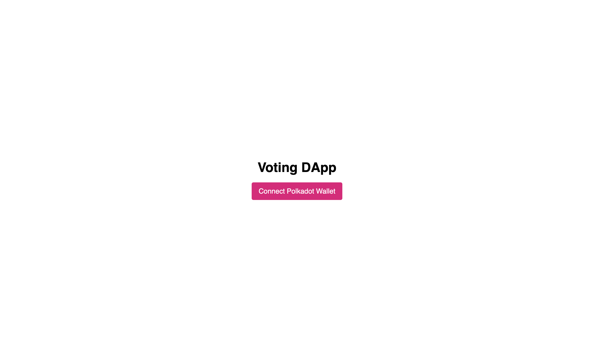

# 🗳️ Voting DApp

A decentralized application (DApp) that allows users to vote on proposals in a transparent, secure, and tamper-proof way using polkadot.

## 🚀 Features

- ✅ **Decentralized voting** on Polkadot
- 🔐 **One vote per wallet address**
- 📊 **Live vote count** updates
- 🧾 **Immutable and transparent** vote records

## 🖥️ Screenshots

### 👤 Wallet Connection

### 🏠 Home

## Implemented

- ✅ Frontend Development: 60% completed with core UI components and basic user flows implemented
- ✅ Polkadot Wallet Integration: Successfully connected Polkadot-compatible wallets
- ✅ Smart Contract Architecture: Designed and developed the smart contract logic
- ✅ Smart Contract Development: Core contracts have been fully written

## Future implementation

- ⏳ Smart Contract Integration with Frontend: Integration initiated, but currently facing deployment issues.
- Encountered limitations with transaction size; attempted optimization via Talisman wallet, but still receiving deployment errors.
- ⏳ Frontend Enhancements: Further development and UI refinement in progress